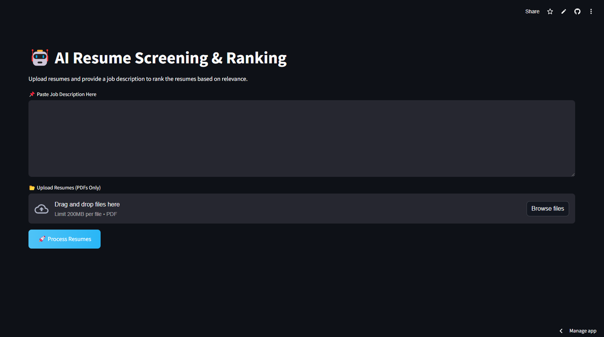
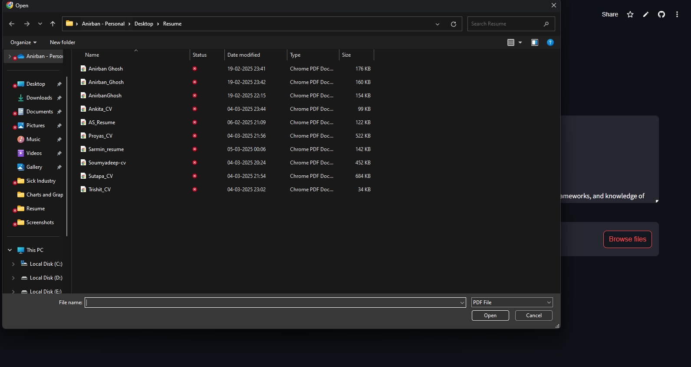
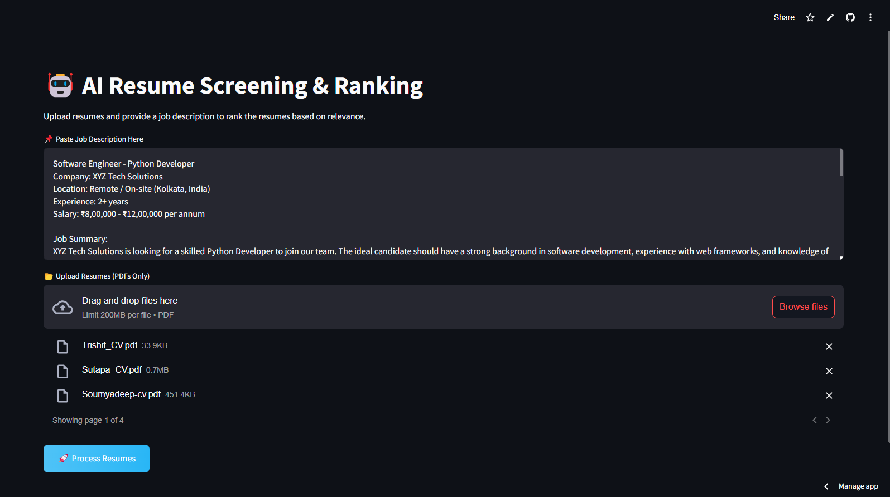
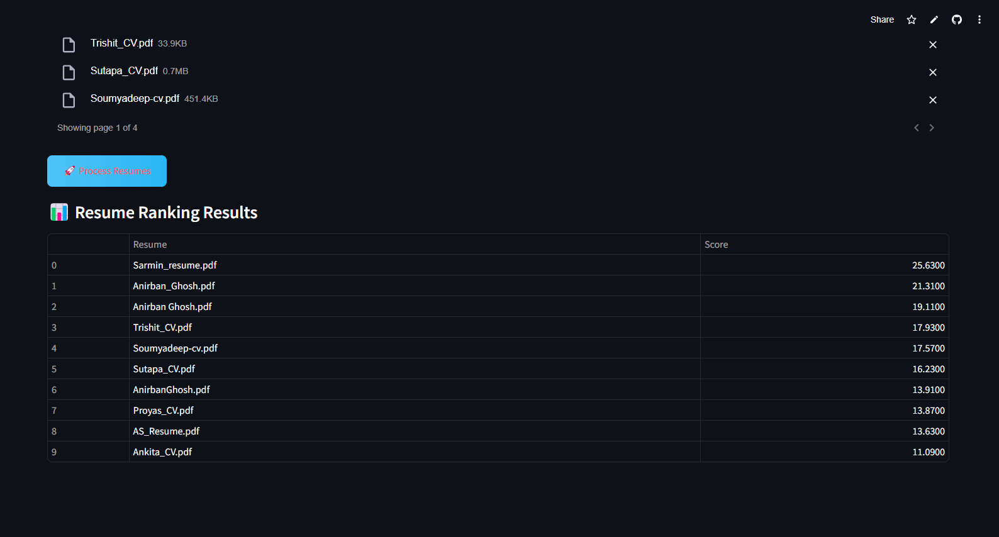

AI-Powered Resume Screening and Candidate Ranking System

📌 Overview

This project is an AI-powered resume screening and ranking system that helps automate the hiring process. It uses Natural Language Processing (NLP) and Machine Learning (ML) to compare resumes with job descriptions and rank candidates based on relevance.

🚀 Features

PDF Resume Upload: Supports multiple resume uploads in PDF format.

Job Description Input: Users can enter a job description to compare resumes.

AI-Based Ranking: Uses TF-IDF Vectorization and Cosine Similarity to rank resumes.

User-Friendly UI: Built with Streamlit for an interactive and easy-to-use experience.

Automated Shortlisting: Saves time by ranking candidates objectively.

🛠️ Tech Stack

Frontend: Streamlit (Python-based UI)

Backend: Python, Scikit-learn, Pandas, NumPy

Machine Learning: TF-IDF, Cosine Similarity, KNN Algorithm

File Processing: PyPDF2 (Extracts text from PDF resumes)

📂 Project Structure

📁 AI-Resume-Screener/
│── 📁 .ipynb_checkpoints    # Checkpoint files for Jupyter Notebook
│── 📁 Snapshots             # Screenshots of results and UI
│── 📁 venv                  # Virtual environment for dependencies
│── app.py                   # Main Streamlit application
│── Demo_LocalHost.mp4       # Demo video of local execution
│── Demo_StreamlitCloud.mp4  # Demo video of cloud deployment
│── README.md                # Project documentation (this file)
│── Report.pdf               # Project report document
│── requirements.txt          # List of dependencies

🔧 Installation & Setup

1️⃣ Clone the Repository

git clone https://github.com/AnirbanGhosh2503/AI-powered-Resume-Screening-and-Ranking-System-Streamlit-.git
cd AI-powered-Resume-Screening-and-Ranking-System-Streamlit-

2️⃣ Install Dependencies

pip install -r requirements.txt

3️⃣ Run the Application

streamlit run app.py

📸 Screenshots

Resume Upload & Job Description Input

Ranking Results

### 🎥 Demo Videos
📌 [Demo - Local Execution](https://drive.google.com/file/d/1BmvIo-14q3jWldf30FGGbivrQ8b3Haza/view?usp=sharing)  
📌 [Demo - Streamlit Cloud](https://drive.google.com/file/d/18sntu1EwK3-DjowBk7y20EVgBpEQkEkb/view?usp=sharing)

🔍 How It Works

Upload Resumes → Users upload multiple PDF resumes.

Enter Job Description → A job description is provided for comparison.

AI Processing → The system extracts text, vectorizes content, and calculates similarity scores.

Ranking & Output → Resumes are ranked based on relevance and displayed in tabular format.

📖 Future Enhancements

Implement Deep Learning Models (e.g., BERT) for improved accuracy.

Add support for more document formats (DOCX, TXT).

Develop an API for ATS integration.

Enhance bias mitigation techniques.

👨‍💻 Contributing

Contributions are welcome! If you'd like to improve the system, fork the repository, make changes, and submit a pull request.

📝 License

This project is open-source under the MIT License.

📩 Contact

👤 Anirban Ghosh📧 Email: 2003anirbanghosh@gmail.com🔗 GitHub: AnirbanGhosh2503